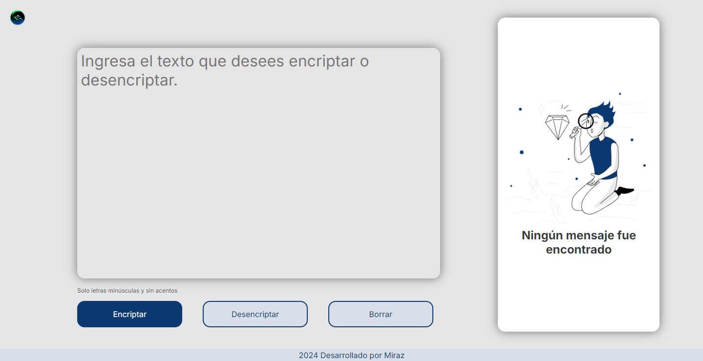

# Encriptador de texto



<div align="center">
    
    
    
</div>

## Indice

[Encriptador de texto](#encriptador-de-texto)

[Indice](#indice)

[Descripcion](#descripción)

[Llaves de encriptacion](#llaves-de-encriptacion)

[Requisitos](#requisitos)

[Link del proyecto](#link-del-proyecto)

[Lenguajes de programacion](#lenguajes-de-programacion)

[Botones](#botones)

[Extras](#extras)


##  Descripción
Pagina web que encripta y desencripta texto, encripta un texto y también devolver un texto encriptado a su versión original.


## Llaves de encriptacion

Maneja las siguientes llaves:

Encriptado

- La letra "**a**" es convertida a "**ai**".
- La letra "**e**" es convertida a "**enter**".
- La letra "**i**" es convertida a "**imes**".
- La letra "**o**" es convertida a "**ober**"
- La letra "**u**" es convertida a "**ufat**"

- La letra "**á**" es convertida a "**ai**".
- La letra "**é**" es convertida a "**enter**".
- La letra "**í**" es convertida a "**imes**".
- La letra "**ó**" es convertida a "**ober**"
- La letra "**ú**" es convertida a "**ufat**"


Desencriptado


- La letra "**ai**" es convertida a "**a*".
- La letra "**enter**" es convertida a "**e**".
- La letra "**imes**" es convertida a "**i**".
- La letra "**ober**" es convertida a "**o**"
- La letra "**ufat**" es convertida a "**u**"


## Requisitos

- Debe funcionar solo con letras minúsculas.

```
Por ejemplo:
"hola mundo" => "hoberlai mufatndober"
"hoberlai mufatndober" => "hola mundo"
```

## Link del proyecto

[Encriptador de texto](https://felix320.github.io/Challenger/) 

## Lenguajes de programacion
Desarrollado con los siguientes lenguajes: 

```
- html,
- css y 
- javascript
```


## botones
- Encriptado
- Desencriptado
- Copiar 
- Borrar

## Extras

\* Se a añadió el boton **borrar** para limpiar los textos de los campos de textarea y poder iniciar con otro texto a encriptar.

\* Las letras con acento las codifica como letras sin acento.

\* Aplicación **responsive**.

---


---

[Inicio](#encriptador-de-texto) ⬆ ⬆

Creado por **Miraz**.